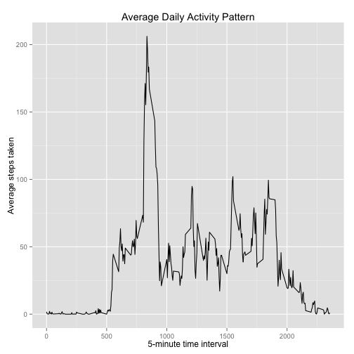
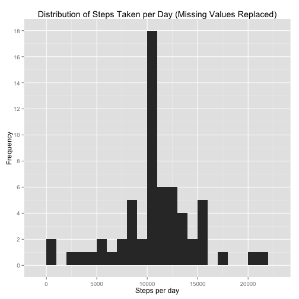
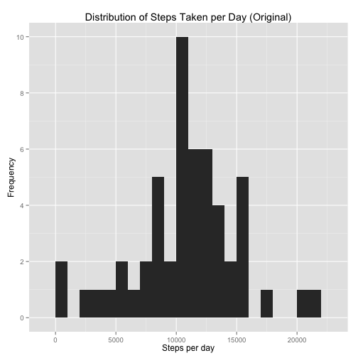
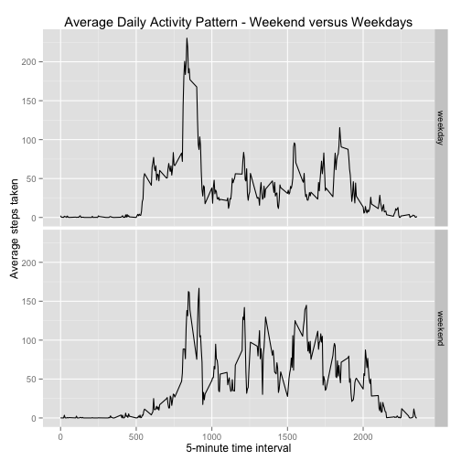

# Reproducible Research: Peer Assessment 1

<hr />

## Loading and preprocessing the data

The following script reads the data into a data frame called `activity`. The script assumes that you have the `activity.csv` source file in your working directory. 


```r
activity <- read.csv('activity.csv')
```

After reading in the dataset, the date variable is converted from a `factor`  to class `Date`.


```r
class(activity$date)
```

```
## [1] "factor"
```

```r
activity$date <- as.Date(activity$date)
class(activity$date)
```

```
## [1] "Date"
```

<hr />

## What is mean total number of steps taken per day?

Before calculating the mean steps taken per day, we are first are asked to create a histogram of the total steps taken each day, which requires calculating a daily sum. The assignment states "you can ignore the missing values in the dataset", but what does that mean in this context exactly?  I chose to leave the NA values in place when calculating the daily sum because in this dataset, a day that contains *any* NA values contains *nothing but* NA values. So dropping NA values would have made the daily sum of steps for those days zero, which would in turn weigh down the daily average (perhaps unfairly). Below is a histogram showing the frequency of daily step counts across all days in the activity dataset *for which data was available.*


```r
library(plyr); library(ggplot2)
dailySteps <- ddply(activity, .(date), summarize, SumSteps = sum(steps, na.rm = FALSE))
histDailySteps <- ggplot(dailySteps, aes(x = SumSteps)) + geom_histogram(binwidth = 1000) + labs(x = "Steps per day", y = "Frequency", title = "Distribution of Steps Taken per Day") + scale_y_continuous(breaks = seq(0, 10, 2))
histDailySteps
```

 

Having seen the distribution of steps taken per day, we are asked to calculate the **mean** and **median** of  steps taken per day. For this step, I removed NA values. In other words, my mean and median values apply to only  *non-NA days.*


```r
dailyAveSteps <- mean(dailySteps$SumSteps, na.rm = TRUE)
cat("The mean of daily steps taken is", dailyAveSteps)
```

```
## The mean of daily steps taken is 10766
```

```r
dailyMedianSteps <- median(dailySteps$SumSteps, na.rm = TRUE)
cat("The median of daily steps taken is", dailyMedianSteps)
```

```
## The median of daily steps taken is 10765
```

<hr />
## What is the average daily activity pattern?

For this question, we want to create a picture of the average day. We first take an average number of steps for each 5-minute interval across all days. We then create a line graph of that data using the ggplot2 package.


```r
library(plyr); library(ggplot2);
dailyPattern <- ddply(activity, .(interval), summarize, AveSteps = mean(steps, na.rm = TRUE))
dailyPatternLine <- ggplot(data = dailyPattern, aes(x = interval, y = AveSteps)) + geom_line() + labs(x = "5-minute time interval", y = "Average steps taken", title = "Average Daily Activity Pattern") 
dailyPatternLine
```

 

To find which 5-minute interval has the highest average number of daily steps, I used the `which.max` function.


```r
mostActiveInterval <- dailyPattern[which.max(dailyPattern$AveSteps), ]
mostActiveInterval
```

```
##     interval AveSteps
## 104      835    206.2
```

To answer the question specifically, we can use the following code:


```r
cat("The interval with the highest average steps is", mostActiveInterval[, 1], "with average steps equaling", mostActiveInterval[, 2])
```

```
## The interval with the highest average steps is 835 with average steps equaling 206.2
```

<hr />
## Imputing missing values

First we are asked to calculate the total number of missing values in the dataset. In the following code, we store that sum in a variable called `totalMissing` and print the result.

```r
totalMissing <- sum(is.na(activity$steps))
totalMissing
```

```
## [1] 2304
```

We are then asked to devise a strategy for filling in the missing values in the dataset. I chose to replace all missing values with the mean of the corresponding 5-minute interval. (These mean values were already calculated above and stored in the `dailyPattern` data frame.) In other words, days with missing values are assumed to be average days. The following code creates a new dataset based on that strategy.


```r
activityImputed <- activity # create a copy of the activity data frame
missingActivityIndex <- which(is.na(activity$steps)) # finds the row indices for missing step values and stores them in a vector
intervalKey <- activity[missingActivityIndex, 3] # given the vector of missing value indices, returns a vector of corresponding daily time intervals
newvals <- sapply(intervalKey, FUN = function(x) {dailyPattern[dailyPattern$interval == x, 2]}, simplify = TRUE ) # returns the average number of steps for a given set of intervals, using the dailyPattern data frame creted in Part 3 above
activityImputed[missingActivityIndex, 1] <- newvals # replaces missing values with average number of steps from corresponding daily interval
```

Below, I plot a histogram of the new data with missing values replaced. I also re-plot the original histogram. Comparing the two, the shape is generally the same, but the middle of the new plot is much taller. To be more precise, the middle bar is taller by 8, because I replaced 8 days of missing values with 8 average days.


```r
dailyStepsIm <- ddply(activityImputed, .(date), summarize, SumSteps = sum(steps, na.rm = FALSE))
histDailyStepsIm <- ggplot(dailyStepsIm, aes(x = SumSteps)) + geom_histogram(binwidth = 1000) + labs(x = "Steps per day", y = "Frequency", title = "Distribution of Steps Taken per Day (Missing Values Replaced)") + scale_y_continuous(breaks = seq(0, 18, 2))
histDailyStepsIm
```

 

```r
histDailySteps + labs(title = "Distribution of Steps Taken per Day (Original)")
```

 

I then recalculate the **mean** and **median** of the steps taken per day. 

```r
dailyAveStepsIm <- mean(dailyStepsIm$SumSteps, na.rm = TRUE)
cat("The mean of daily steps taken is", dailyAveStepsIm)
```

```
## The mean of daily steps taken is 10766
```

```r
dailyMedianStepsIm <- median(dailyStepsIm$SumSteps, na.rm = TRUE)
cat("The mean of daily steps taken is", dailyMedianStepsIm)
```

```
## The mean of daily steps taken is 10766
```

The assignment asks whether these values differ from the estimates from the first part of the assignment. In my case, the mean is exactly the same and the median is one step higher. It makes sense that these values didn't change (or not by much, anyway). I replaced missing values with values from the average daily pattern. So the effect was to make the entire data set look **more average**. So the mean and median didn't change much, but the distribution of values did.

<hr />
## Are there differences in activity patterns between weekdays and weekends?

To disinguish between weekdays and weekend days, I create a new factor variable in the dataset with two levels indicating whether a given date is a weekday or weekend day. 


```r
# add a new column to the data for the day of the week 
activityImputed$weekday <- weekdays(activity$date)
# add another column that identifies weekend days versus weekdays
week <- c("Monday", "Tuesday", "Wednesday", "Thursday", "Friday")
end <- c("Saturday", "Sunday")
activityImputed$week_end[activityImputed$weekday %in% week] <- "weekday"
activityImputed$week_end[activityImputed$weekday %in% end] <- "weekend"
```

I then calculate the the average number of steps taken per day for weekends and weekdays. A panel plot is then drawn, comparing the average weekday to the average weekend day. The plot shows some obvious differences between weekday and weekend activity patterns, like the fact that (on average) people start moving later on the weekends. Interestingly, weekends have a significantly lower peak than weekdays, something I wouldn't have necessarily expected.


```r
# split the data according to weekend days versus weekdays and calculate daily averages for each
mysplit <- split(activityImputed, activityImputed$week_end)
dailyPattern1 <- ddply(mysplit[[1]], .(interval, week_end), summarize, AveSteps = mean(steps, na.rm = TRUE))
dailyPattern2 <- ddply(mysplit[[2]], .(interval, week_end), summarize, AveSteps = mean(steps, na.rm = TRUE))
# recombine the data and make a facet plot to compare weekend days and weekdays
wwData <- rbind(dailyPattern1, dailyPattern2)
wwDataLine <- ggplot(data = wwData, aes(x = interval, y = AveSteps)) + geom_line() 
wwDataLine + facet_grid(week_end ~ .) + labs(x = "5-minute time interval", y = "Average steps taken", title = "Average Daily Activity Pattern - Weekend versus Weekdays")
```

 
